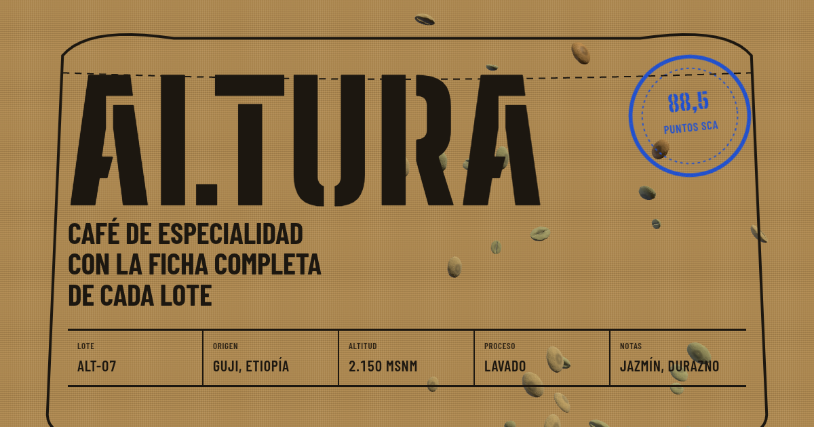

# Altura · café de especialidad, de la planta a la taza

**App en vivo:** https://altura-cafe.webflow.io/
Proyecto para el concurso de apps de **Webflow Cloud** en **Nerdearla 2026**.

Altura es una tostadería **ficticia**. La app sigue un lote de café verde desde la planta hasta la taza y muestra la ficha técnica completa de cada café: origen, altitud, variedad, proceso, notas, perfil sensorial, molienda por método y receta. Los lotes son de muestra: los orígenes, variedades y procesos son categorías reales, pero las fincas, productores y puntajes son ilustrativos.



## Qué hay en la página

| Sección | Qué hace | Cómo está hecho |
|---|---|---|
| **Portada** | Granos de café 3D que caen detrás del estarcido "ALTURA". Se apartan del puntero y, al hacer clic, se tuestan y crujen. | Three.js con geometría de grano procedural (hendidura en S), texturas generadas en canvas (moteado, arrugas en relieve, película en la hendidura), `MeshPhysicalMaterial` con brillo que depende del tueste. El crujido usa Web Audio. |
| **Granos al saco** | En escritorio, al hacer scroll, los granos se desvían hacia la boca del saco de la historia. | Se proyecta la posición del saco del DOM al plano 3D con un raycast en cada cuadro. |
| **La historia** | Nueve etapas (planta → taza). El saco de arpillera se estampa etapa por etapa y **se frunce y se ata** con el scroll. | SVG con la boca del saco interpolada entre dos trazados, estampas con `feTurbulence` que simula tinta gastada y trama de arpillera generada una vez en canvas. |
| **Tostador y molinillo** | Un grano 3D que se tuesta con un control (color, brillo y tamaño) y un molinillo que muestra el tamaño de partícula y la cafetera de cada método. | Three.js + SVG. |
| **La taza** | Taza de gres artesanal con el logo NERD que se llena con el scroll y termina con un **corazón de latte art**. El café toma el color del tueste que elegiste. | `LatheGeometry` con textura de esmalte moteado y base de barro, crema y latte art pintados en canvas. |
| **Mapa de altura** | Relieve 3D con curvas de nivel y una bandera por lote a su altitud real. | Terreno procedural con bandas de elevación y etiquetas HTML proyectadas desde el 3D. |
| **La carta** | Seis sacos que se inclinan en 3D y se voltean para abrir su ficha. Comparador de lotes lado a lado y **"me gusta" compartidos**. | CSS 3D, máscara SVG con la silueta del saco y contador en SQLite. |
| **Encuentra tu café** | Quiz de cuatro preguntas que recomienda un lote, su molienda y su receta. Genera una **tarjeta para compartir**. | `POST /api/recomendar` y canvas + Web Share API. |
| **Barista IA** | Chat que responde solo sobre la carta, en streaming, y convierte los lotes que menciona en links a su ficha. | `POST /api/barista` con la API de OpenAI (SSE → texto plano) y límite de uso en KV. |

## Webflow Cloud

- **Runtime:** Next.js 16 (App Router) sobre Cloudflare Workers mediante OpenNext, desplegado desde GitHub en Webflow Cloud.
- **SQLite (`DB`):** contador de "me gusta" por lote (`migraciones/0001_me_gusta.sql`).
- **Key Value Store (`LIMITES`):** límite de uso del barista IA y un "me gusta" por visitante cada 24 h.
- **CMS de Webflow + MCP de Webflow:** la carta vive en la colección **"Lotes"** del sitio `altura-cms`. La colección, sus 24 campos y los seis lotes se crearon con el **MCP de Webflow** desde Claude Code. La app lee la carta con la **Data API** en cada request (`src/lib/carta.ts`) y la cachea 5 minutos en KV: si se edita un café en el CMS, la app se actualiza sin redeploy. Si el CMS no responde o falta el token, usa la carta local y la página no se rompe. Cuando la carta viene del CMS, la sección muestra "Carta servida en vivo desde el CMS de Webflow".
- **Variables de entorno:** `OPENAI_API_KEY` y `WEBFLOW_API_TOKEN` (token del sitio con lectura de CMS) son secretos del entorno; `OPENAI_MODEL` y `WEBFLOW_COLLECTION_ID` son opcionales. Nunca se guardan en el repo.
- Los bindings se declaran en `wrangler.json`. Si la app corre fuera del runtime de Workers, las API caen a memoria.

## Estructura

```
src/app/page.tsx                 portada y armado de la página
src/app/components/Historia.tsx  historia, saco que se ata, molinillo
src/app/components/three/*       granos, tostador y taza (Three.js)
src/app/components/MapaAltura.tsx
src/app/components/Carta.tsx     sacos, ficha, comparador, me gusta
src/app/components/Pedido.tsx    quiz, tarjeta para compartir, barista
src/app/api/*                    recomendar, barista, megusta, cafes
src/lib/cafes.ts                 datos de la carta (lotes de muestra)
DESIGN.md · PRODUCT.md           sistema de diseño y producto
```

## Desarrollo local

```bash
npm install
npm run dev
```

Para usar el barista en local, crea `.env.local` a partir de `.env.example` con tu `OPENAI_API_KEY`.

## Accesibilidad

Todas las animaciones respetan `prefers-reduced-motion`. El contenido del 3D también está disponible como texto y como botones: la escala de altitudes, las fichas y el quiz se pueden usar con teclado.
